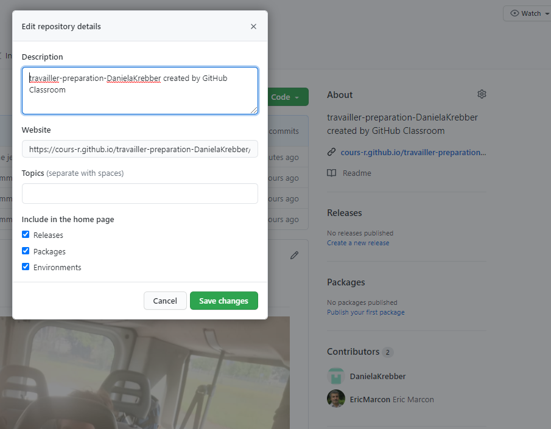

# Daniela Krebber

Ce dépôt destiné à la classe GitHub Cours-R contient des ressources pour les étudiants:

- Packages.R : script d'installation des packages

## Instructions

Copiez et adaptez à vos besoins le fichier Packages.R

Modifiez le fichier `README.md` :

- Remplacez le titre principal par votre nom ;
- Remplacez le logo d'EcoFoG par votre photo ;

Mettez à jour le dépôt :

- Créez le dossier `docs`, copiez-y `README.md` et `images/` ;
- Activez les pages GitHub et vérifiez leur bon fonctionnement.

Résultat attendu : le site https://cours-r.github.io/travailler-preparation-GitHubID (où GitHubID est votre identifiant GitHub) doit afficher vos nom et photo.

## Support de cours

- [Programme de travail](https://1drv.ms/f/s!Amvhelr37CHjkOAgkKTimmgPL0YL8Q) ;
- [Support de cours](https://ericmarcon.github.io/travailleR/) ;
- [Présentations](https://ericmarcon.github.io/Cours-travailleR/).

## Read me 
needs to exist in the docs and maybe also in the racine - but it doesn't seem like that

## Publish website 
Here you publish the website in settings under the name Github pages.
* Choose master branch and docs that you created
* The read me and images should be placed in the docs folder
(site web tous le temps branch master et publier le docs et pas le root. You find this in Settings - Github pages)
* You can also select a theme for your site

Add the web site

When creating a new project with version control - empty one - no branch selected.. this poses problems so do a comit then there it is named the branch 
click on branch name it as well master like the branch shown  - then write REmote Name origin and paste in the Remote URL 
Remote in new branch selected none... 
then choose add and select overwrite as the master branch already existed before. 